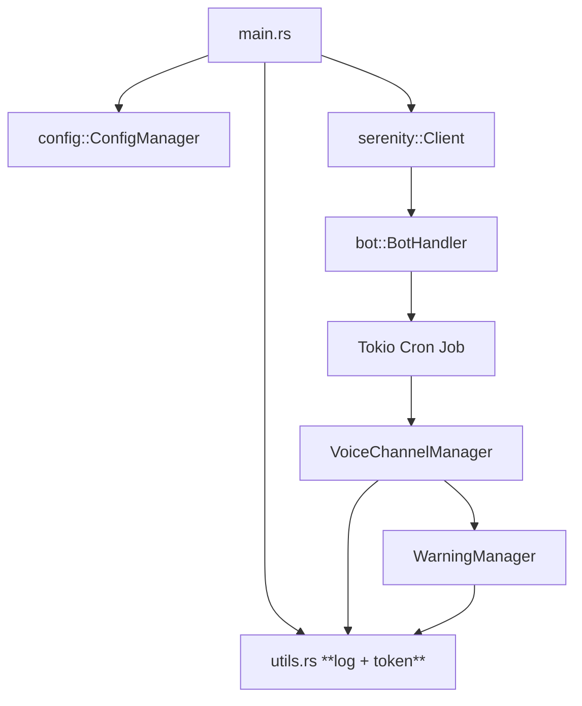
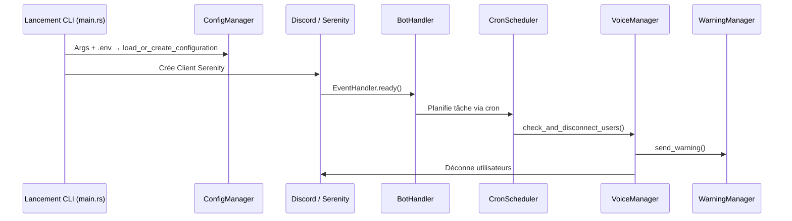
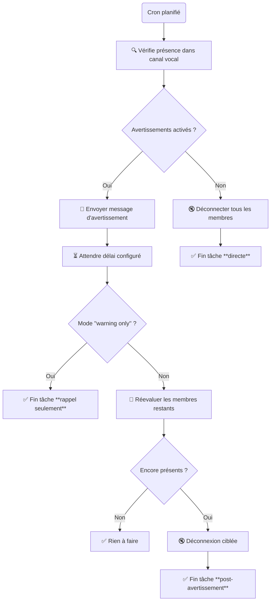
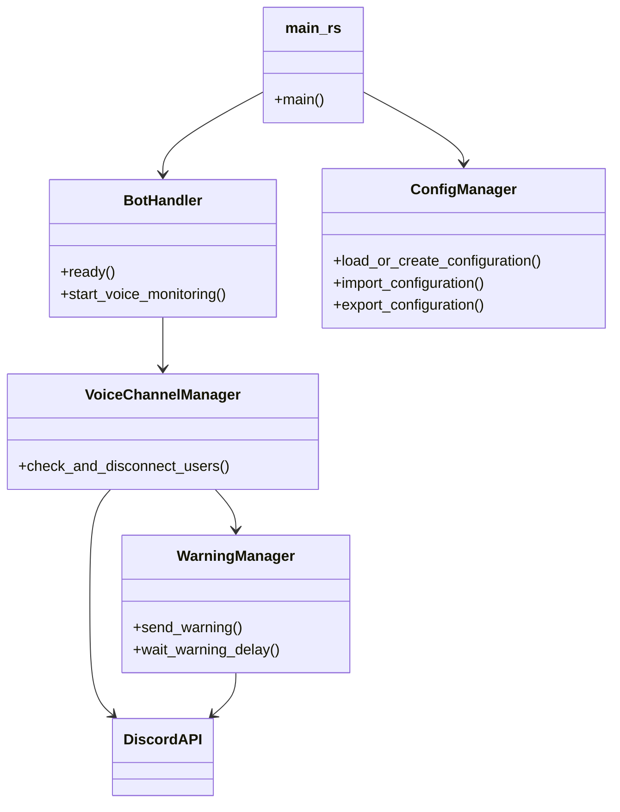

# 🧠 Architecture du bot Discord — LeKickerFou

Ce document présente l'architecture fonctionnelle du bot LeKickerFou, afin de visualiser les interactions entre les composants, leurs rôles et les points d'intelligence du système.

---

## 📦 Vue modulaire de l'architecture

---

## 📋 Flux global de démarrage

---

### ⏱️ Tâche planifiée : déroulement complet (corrigé)

---

## 📁 Structure des fichiers

---
